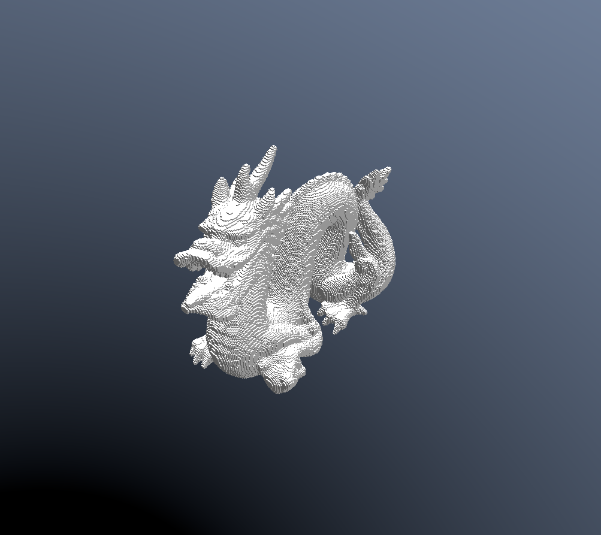
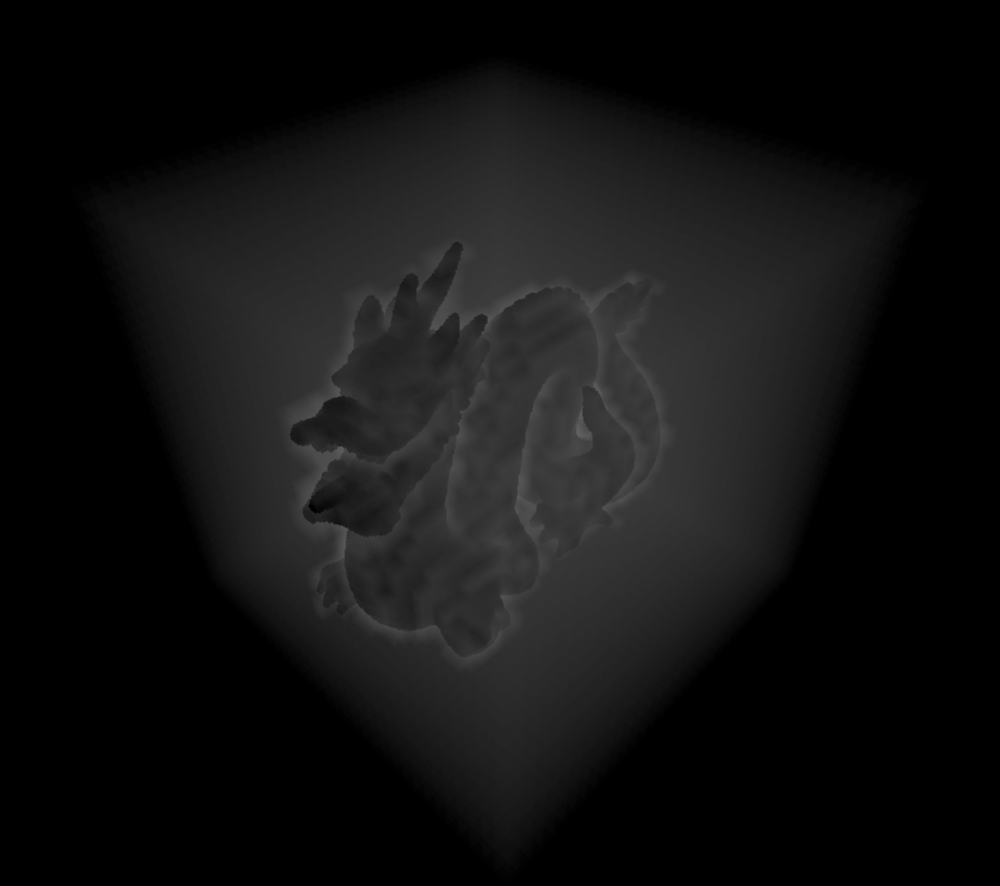

# Voxel engine




## Requirements

- CMake 3.5+
- C++ 20 compiler
- OpenGL 4.5+

## Build instructions

Dependencies should be downloaded automatically when running CMake, if they don't for some reason, download and extract
the following
libraries into the *Libs* directory:

1. https://github.com/Perlmint/glew-cmake/archive/refs/tags/glew-cmake-2.2.0.zip
2. https://github.com/glfw/glfw/releases/download/3.4/glfw-3.4.zip
3. https://github.com/ocornut/imgui/archive/refs/tags/v1.91.8.zip
4. https://github.com/g-truc/glm/releases/download/1.0.1/glm-1.0.1-light.7z
5. https://github.com/assimp/assimp/archive/refs/tags/v5.4.3.zip

### Linux

```
$ mkdir build
$ cd build
cmake ..
make
```

*Tip: use "make -j n" where n is the number of threads available on your machine to make the compilation a lot faster.*

### Windows

1. Create build folder.
2. Open CMake GUI.
3. Set project root as input, and the build folder as output.
4. Click configure and select the desired solution file.
5. Generate.

Make sure to set *vox* as startup project.

## Usage

Run from terminal, required arguments are:

1. Path to a 3D model, this project uses *assimp* for model loading, thus almost any format should work.
2. Number of subdivisions, resulting scene will have the size of 2^n. *Note: any value higher than 10 will require a
   significant amount of memory.*

To move around the scene, hold *right click* in the window to activate the free-fly camera, *WASD* is used to move
around,
*E* and *Q* are used to move up and down. While holding *right click*, press *left click* to place a voxel, hold down
*Space* to remove voxels, the affected radius can be modified through the ImGui window. Press *Esc* to exit.
